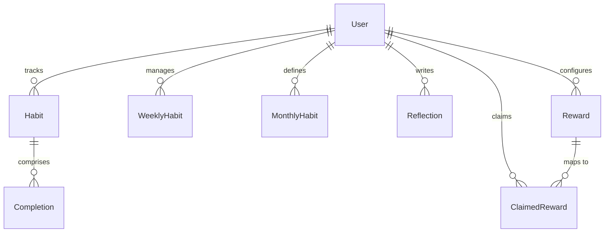

# SystemOS Database Schema

This document details the database models, relations, index configurations, and constraint optimizations built in Prisma for the MySQL database.

---

## 🗺️ Entity-Relationship Topology

---

## 🗄️ Model Schema Reference

### 1. `User`
Stores client profile information and credentials hashes.
* **Fields**:
  * `id`: String (UUID, primary key)
  * `email`: String (unique index)
  * `passwordHash`: String (bcrypt hash)
  * `name`: String (nullable)
  * `createdAt`: DateTime (default now)

### 2. `Habit`
Represents a daily tracked habit for a specific user and month.
* **Fields**:
  * `id`: String (UUID, PK)
  * `userId`: String (foreign key to `User`)
  * `name`: String
  * `month`: Int
  * `year`: Int
  * `goalDays`: Int (default 30)
  * `displayOrder`: Int
* **Indexes & Constraints**:
  * `@@unique([userId, name, month, year])`: Restricts duplicate names.
  * `@@index([userId, month, year])`: Optimized filter lookup.

### 3. `Completion`
Checkmark logs indicating that a daily habit was completed on a given date.
* **Fields**:
  * `id`: String (UUID, PK)
  * `habitId`: String (FK to `Habit`, on delete cascade)
  * `date`: String (YYYY-MM-DD format to prevent timezone offset shifts)
* **Indexes & Constraints**:
  * `@@unique([habitId, date])`: Restricts duplicate checks for a single day.
  * `@@index([habitId])`: Optimized index for joining habit records.

### 4. `WeeklyHabit`
Weekly task checklists for weeks 1 to 5.
* **Fields**:
  * `id`: String (UUID, PK)
  * `userId`: String (FK to `User`)
  * `name`: String
  * `month`, `year`: Int
  * `weekIndex`: Int (1-5)
  * `completed`: Boolean (default false)
* **Indexes**:
  * `@@index([userId, month, year])`

### 5. `MonthlyHabit`
Core objectives to achieve during the month.
* **Fields**:
  * `id`: String (UUID, PK)
  * `userId`: String (FK to `User`)
  * `name`: String
  * `month`, `year`: Int
  * `completed`: Boolean (default false)
* **Indexes**:
  * `@@index([userId, month, year])`

### 6. `Reflection`
Affirmations, polaroids, and notes summaries written at the end of the month.
* **Fields**:
  * `id`: String (UUID, PK)
  * `userId`: String (FK to `User`)
  * `month`, `year`: Int
  * `text`: String (text field)
  * `polaroidUrl`: String (nullable image url)
  * `affirmation`: String (nullable quote)
* **Constraints**:
  * `@@unique([userId, month, year])`: Restricts entries to 1 reflection log per user per month.

### 7. `Reward`
The reward options available to choose from.
* **Constraints**:
  * `@@unique([userId, name, month, year])`
  * `@@index([userId, month, year])`

### 8. `ClaimedReward`
Tracks which reward templates were claimed on specific calendar dates.
* **Indexes**:
  * `@@index([userId, date])`: Accelerates claims lookups.
  * `@@index([rewardId])`: Joins reward option details.
